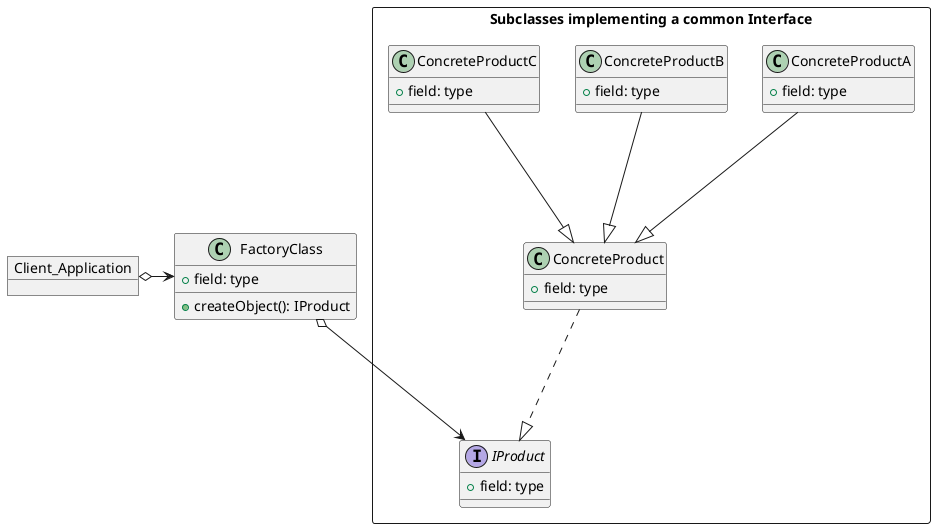

# The Factory Pattern

---

The Factory Pattern is one of the most common design patterns in software development. When developing code, you may need to instantiate objects directly in methods or in classes. With the Factory Pattern you can create objects without exposing the creation logic to the client. This adds a extra layer of abstraction which will also allow you to dynamically choose classes to instantiate based on some kind of logic.

Before the abstraction your client, class, or method would directly instantiate an object of a class. After adding the factory abstraction the concrete product (object) is now created outside the current class/method and now in a sub class instead.

### Example

---

Imagine an application that for designing houses and the house has chair already added on the floor by default. By adding the Factory Pattern you could give the option to the user to choose different chairs and how many at runtime. Instead of the chair being hard coded into the project when it started, now the user has the option to choose.

Adding this extra layer of abstraction also means that the complications of instantiating extra objects can now be hidden from the class or method that is using it. This separation of concerns also means that the code is more testable and easier to maintain.

### Terminology

---

-   **Concrete Creator** - The client application, class, or method that call the Creator (Factory method.)

-   **Product Interface** - The interface describing the attributes and methods that the Factory will require in order to create the final product/object.

-   **Creator** - The Factory class. Declares the Factory method that will return the object requested from it.

-   **Concrete Product** - The object returned from the Factory. The object implements the Product interface.

### Factory UML Diagram

---

If you have the PlantUML extension installed on VS Code and GraphViz and Java installed on your machine your can preview and edit the UML diagram directly in VS Code. In case you do not want to have to go through the process of adding the extension, and installing its dependencies you can also copy and paste the PlantUML code below into the PlantUML online editor [here](https://www.planttext.com/). I also provided a png file of the UML diagram in the current working directory.

The Client Application will call the createObject Method of the Factory Class which will return either ConcreteProductA, ConcreteProductB or ConcreteProductC depending on which ever was requested.They all extend the ConcreteProduct base class which conforms to the IProduct interface.

In coded example the client wants an object named b. Rather than creating b directly in the client, it asks the creator (factory) for the object instead. The factory find the relevant class using some kind of logic from the attributes of the request. It then asks the subclass to instantiate the new object it then returns as a reference back to the client asking for it.
